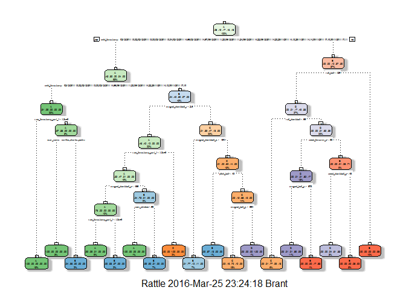
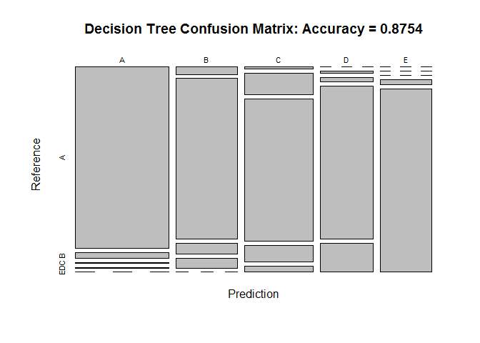
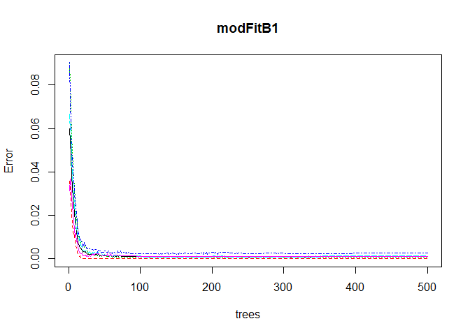
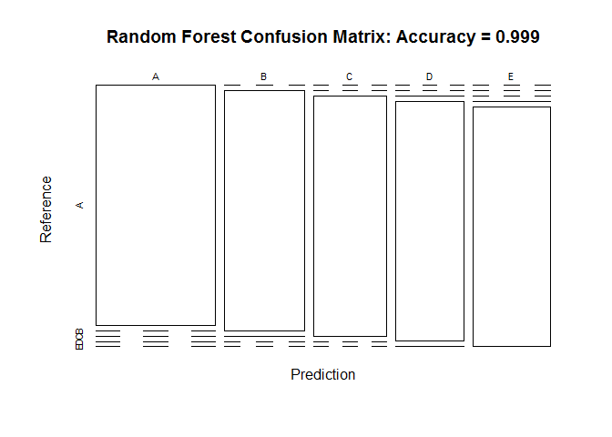
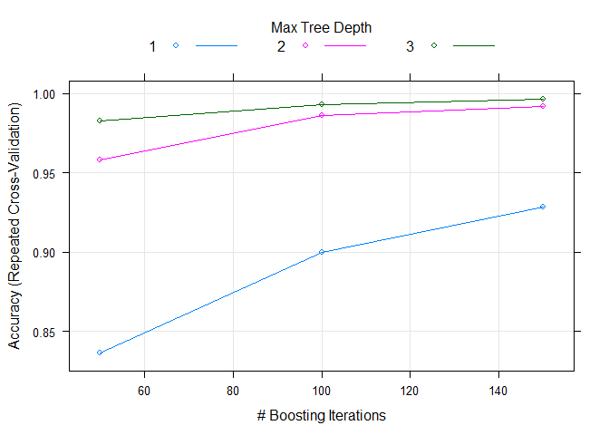

Background and Introduction
===========================

Using devices such as *Jawbone Up*, *Nike FuelBand*, and *Fitbit* it is
now possible to collect a large amount of data about personal activity
relatively inexpensively. These type of devices are part of the
quantified self movement - a group of enthusiasts who take measurements
about themselves regularly to improve their health, to find patterns in
their behavior, or because they are tech geeks.

One thing that people regularly do is quantify how much of a particular
activity they do, but they rarely quantify how well they do it. In this
project, we will use data recorded from accelerometers on the belt,
forearm, arm, and dumbbell of 6 participants. They were asked to perform
barbell lifts correctly and incorrectly in 5 different ways.

More information is available from the website
<http://groupware.les.inf.puc-rio.br/har> (see the section on the Weight
Lifting Exercise Dataset).

The goal of this project is to predict the manner in which the
participants did the exercise. This is the classe variable of the
training set, which classifies the correct and incorrect outcomes into
A, B, C, D, and E categories. This report describes how the model for
the project was built, cross-validation, expected out of sample error
calculation, and the choices made. It was used successfully to
accurately predict all 20 different test cases on the Coursera website.

Data Description
================

The training data for this project are available here:
<https://d396qusza40orc.cloudfront.net/predmachlearn/pml-training.csv>

The test data are available here:
<https://d396qusza40orc.cloudfront.net/predmachlearn/pml-testing.csv>

The data for this project come from this source:
<http://groupware.les.inf.puc-rio.br/har>.

We first download the data from the links referenced above to our
computer and upload the files into R (using RStudio), interpreting the
miscellaneous NA, \#DIV/0! and empty fields as NA:

    library(caret,verbose=FALSE)

    ## Loading required package: lattice

    ## Loading required package: ggplot2

    library(rpart,verbose=FALSE)
    library(rpart.plot,verbose=FALSE)
    library(RColorBrewer,verbose=FALSE)
    library(rattle,verbose=FALSE)

    ## Rattle: A free graphical interface for data mining with R.
    ## XXXX 4.1.0 Copyright (c) 2006-2015 Togaware Pty Ltd.
    ## Type 'rattle()' to shake, rattle, and roll your data.

    library(randomForest,verbose=FALSE)

    ## randomForest 4.6-12

    ## Type rfNews() to see new features/changes/bug fixes.

    ## 
    ## Attaching package: 'randomForest'

    ## The following object is masked from 'package:ggplot2':
    ## 
    ##     margin

    library(knitr,verbose=FALSE)

    set.seed(1000)
    trainUrl <- "http://d396qusza40orc.cloudfront.net/predmachlearn/pml-training.csv"
    testUrl <- "http://d396qusza40orc.cloudfront.net/predmachlearn/pml-testing.csv"
    training <- read.csv(url(trainUrl), na.strings=c("NA","#DIV/0!",""))
    testing <- read.csv(url(testUrl), na.strings=c("NA","#DIV/0!",""))

We take a quick look at the data and particularly at `classe` which is
the variable we need to predict:

    table(training$classe)

    ## 
    ##    A    B    C    D    E 
    ## 5580 3797 3422 3216 3607

Partioning the training set into two

    inTrain <- createDataPartition(training$classe, p=0.75, list=FALSE)
    myTraining <- training[inTrain, ]
    myTesting <- training[-inTrain, ]
    dim(myTraining); dim(myTesting)

    ## [1] 14718   160

    ## [1] 4904  160

Cleaning the Data
=================

Remove NearZeroVariance variables

    nzv <- nearZeroVar(myTraining, saveMetrics=TRUE)
    myTraining <- myTraining[,nzv$nzv==FALSE]
    nzv<- nearZeroVar(myTesting,saveMetrics=TRUE)
    myTesting <- myTesting[,nzv$nzv==FALSE]

Killing first column of Dataset - ID Removing first ID variable so that
it does not interfer with ML Algorithms:

    myTraining <- myTraining[-1]

Clean variables with more than 60% NA

    n <- nrow(myTraining)
    cols <- length(myTraining)
    remove_list <- NULL
    for(i in 1:cols) {
        if( sum( is.na( myTraining[, i] ) ) /n >= .7) {
            remove_list <-c(remove_list,i)
        }
    }
    myTraining <-myTraining[,-remove_list]

Transform the myTesting and testing data sets

    clean1 <- colnames(myTraining)
    clean2 <- colnames(myTraining[,-58])
    myTesting <- myTesting[clean1]         
    testing <- testing[clean2]            

    dim(myTesting);dim(testing)

    ## [1] 4904   58

    ## [1] 20 57

    # To get the same class between testing and myTraining
    testing <- rbind(myTraining[2, -58] , testing)
    testing <- testing[-1,]

Prediction with Decision Trees
==============================

    modFitA1 <- rpart(classe ~ ., data=myTraining, method="class")
    fancyRpartPlot(modFitA1)

  
Cross-validation on the `myTesting`

    predictionsA1 <- predict(modFitA1, myTesting, type = "class")
    cmtree <- confusionMatrix(predictionsA1, myTesting$classe)
    cmtree

    ## Confusion Matrix and Statistics
    ## 
    ##           Reference
    ## Prediction    A    B    C    D    E
    ##          A 1348   41    8    4    0
    ##          B   36  782   52   48    0
    ##          C   11  118  776   90   34
    ##          D    0    8   19  640  120
    ##          E    0    0    0   22  747
    ## 
    ## Overall Statistics
    ##                                           
    ##                Accuracy : 0.8754          
    ##                  95% CI : (0.8658, 0.8845)
    ##     No Information Rate : 0.2845          
    ##     P-Value [Acc > NIR] : < 2.2e-16       
    ##                                           
    ##                   Kappa : 0.8424          
    ##  Mcnemar's Test P-Value : NA              
    ## 
    ## Statistics by Class:
    ## 
    ##                      Class: A Class: B Class: C Class: D Class: E
    ## Sensitivity            0.9663   0.8240   0.9076   0.7960   0.8291
    ## Specificity            0.9849   0.9656   0.9375   0.9641   0.9945
    ## Pos Pred Value         0.9622   0.8519   0.7541   0.8132   0.9714
    ## Neg Pred Value         0.9866   0.9581   0.9796   0.9602   0.9628
    ## Prevalence             0.2845   0.1935   0.1743   0.1639   0.1837
    ## Detection Rate         0.2749   0.1595   0.1582   0.1305   0.1523
    ## Detection Prevalence   0.2857   0.1872   0.2098   0.1605   0.1568
    ## Balanced Accuracy      0.9756   0.8948   0.9226   0.8801   0.9118

    plot(cmtree$table, main = paste("Decision Tree Confusion Matrix: Accuracy =", round(cmtree$overall['Accuracy'], 4)))

  

Prediction with Random Forests
==============================

    modFitB1 <- randomForest(classe ~ ., data=myTraining)
    predictionB1 <- predict(modFitB1, myTesting, type = "class")
    cmrf <- confusionMatrix(predictionB1, myTesting$classe)
    cmrf

    ## Confusion Matrix and Statistics
    ## 
    ##           Reference
    ## Prediction    A    B    C    D    E
    ##          A 1395    0    0    0    0
    ##          B    0  949    1    0    0
    ##          C    0    0  853    0    0
    ##          D    0    0    1  803    2
    ##          E    0    0    0    1  899
    ## 
    ## Overall Statistics
    ##                                           
    ##                Accuracy : 0.999           
    ##                  95% CI : (0.9976, 0.9997)
    ##     No Information Rate : 0.2845          
    ##     P-Value [Acc > NIR] : < 2.2e-16       
    ##                                           
    ##                   Kappa : 0.9987          
    ##  Mcnemar's Test P-Value : NA              
    ## 
    ## Statistics by Class:
    ## 
    ##                      Class: A Class: B Class: C Class: D Class: E
    ## Sensitivity            1.0000   1.0000   0.9977   0.9988   0.9978
    ## Specificity            1.0000   0.9997   1.0000   0.9993   0.9998
    ## Pos Pred Value         1.0000   0.9989   1.0000   0.9963   0.9989
    ## Neg Pred Value         1.0000   1.0000   0.9995   0.9998   0.9995
    ## Prevalence             0.2845   0.1935   0.1743   0.1639   0.1837
    ## Detection Rate         0.2845   0.1935   0.1739   0.1637   0.1833
    ## Detection Prevalence   0.2845   0.1937   0.1739   0.1644   0.1835
    ## Balanced Accuracy      1.0000   0.9999   0.9988   0.9990   0.9988

    plot(modFitB1)

  

    plot(cmrf$table, col = cmtree$byClass, main = paste("Random Forest Confusion Matrix: Accuracy =", round(cmrf$overall['Accuracy'], 4)))

  
 \# Prediction with Generalized Boosted Regression

    fitControl <- trainControl(method = "repeatedcv",
                               number = 5,
                               repeats = 1)

    gbmFit1 <- train(classe ~ ., data=myTraining, method = "gbm",
                     trControl = fitControl,
                     verbose = FALSE)

    ## Loading required package: gbm

    ## Loading required package: survival

    ## 
    ## Attaching package: 'survival'

    ## The following object is masked from 'package:caret':
    ## 
    ##     cluster

    ## Loading required package: splines

    ## Loading required package: parallel

    ## Loaded gbm 2.1.1

    ## Loading required package: plyr

    gbmFinMod1 <- gbmFit1$finalModel

    gbmPredTest <- predict(gbmFit1, newdata=myTesting)
    gbmAccuracyTest <- confusionMatrix(gbmPredTest, myTesting$classe)
    gbmAccuracyTest

    ## Confusion Matrix and Statistics
    ## 
    ##           Reference
    ## Prediction    A    B    C    D    E
    ##          A 1395    0    0    0    0
    ##          B    0  949    0    0    0
    ##          C    0    0  850    2    0
    ##          D    0    0    5  798    6
    ##          E    0    0    0    4  895
    ## 
    ## Overall Statistics
    ##                                          
    ##                Accuracy : 0.9965         
    ##                  95% CI : (0.9945, 0.998)
    ##     No Information Rate : 0.2845         
    ##     P-Value [Acc > NIR] : < 2.2e-16      
    ##                                          
    ##                   Kappa : 0.9956         
    ##  Mcnemar's Test P-Value : NA             
    ## 
    ## Statistics by Class:
    ## 
    ##                      Class: A Class: B Class: C Class: D Class: E
    ## Sensitivity            1.0000   1.0000   0.9942   0.9925   0.9933
    ## Specificity            1.0000   1.0000   0.9995   0.9973   0.9990
    ## Pos Pred Value         1.0000   1.0000   0.9977   0.9864   0.9956
    ## Neg Pred Value         1.0000   1.0000   0.9988   0.9985   0.9985
    ## Prevalence             0.2845   0.1935   0.1743   0.1639   0.1837
    ## Detection Rate         0.2845   0.1935   0.1733   0.1627   0.1825
    ## Detection Prevalence   0.2845   0.1935   0.1737   0.1650   0.1833
    ## Balanced Accuracy      1.0000   1.0000   0.9968   0.9949   0.9962

    plot(gbmFit1)

  
 \# Predicting Results on the Test Data

Random Forests gave an Accuracy in the myTesting dataset of 99.94%,
which was more accurate that what I got from the Decision Trees or GBM.
The expected out-of-sample error is 100-99.94 = 0.06%.

    predictionB2 <- predict(modFitB1, testing, type = "class")
    predictionB2

    ##  2 31  4  5  6  7  8  9 10 11 12 13 14 15 16 17 18 19 20 21 
    ##  B  A  B  A  A  E  D  B  A  A  B  C  B  A  E  E  A  B  B  B 
    ## Levels: A B C D E

Conclusion
==========

In this assignment, we accurately predicted the classification of 20
observations using a Random Forest algorithm trained on a subset of data
using less than 20% of the covariates.

The accuracy obtained (accuracy = 99.94%, and out-of-sample error =
0.06%) is obviously highly suspicious as it is never the case that
machine learning algorithms are that accurate, and a mere 85% if often a
good accuracy result.

Either the 6 participants for whom we have data were extraordinarily
obedient (for more than 19 thousand observations, a strong performance!
This however might be explained by the highly controlled conditions of
the data collection), or the data was somehow doctored for this class,
or additional testing needs to be performed on other different
participants, or Fitbit really works!

It may be interesting to apply the fitModel tree from the Random Forest
algorithm obtained in this paper (without any re-calibration) to a
completely new set of participants, to complement and validate the
analysis.

This project was a very interesting introduction to practical machine
learning, and opened up many doors in machine learning in R.
